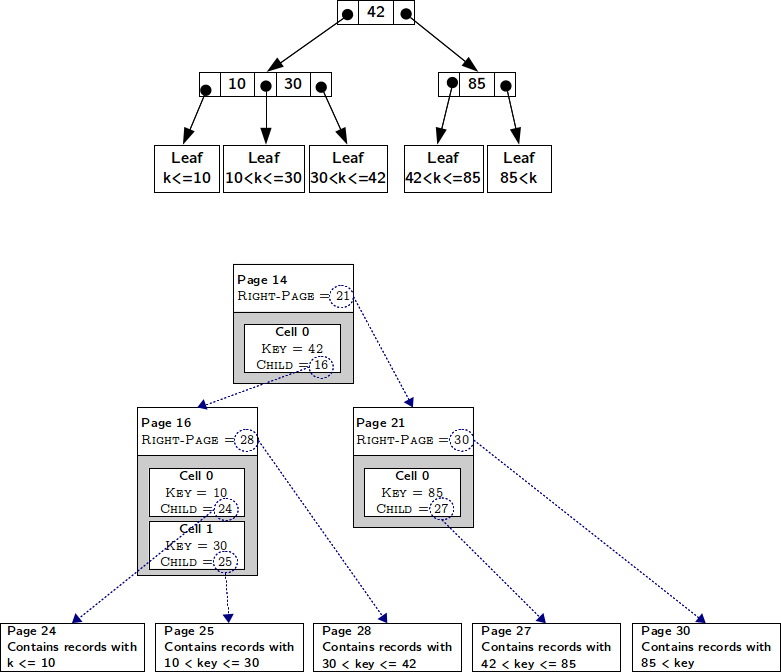
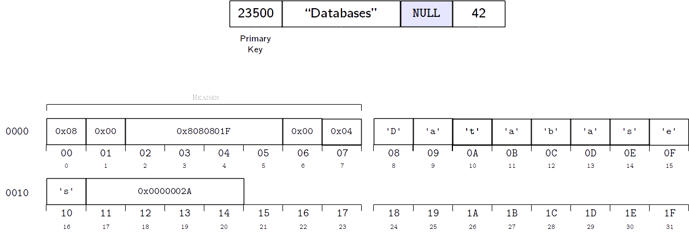

.. _chidb-fileformat:

The chidb File Format
=====================

This section describes the format of a chidb database file. We assume a
basic knowledge of RDBMS (a student should know what a table and an
index is) and what a B-Tree is. This documentation does not explain
*how* the B-Tree operations must be performed, just how the B-Tree
is stored using a specific file format.

This section presents the file format in a top-down fashion. We will start
by presenting a high-level overview of the file, where certain details will
seem handwavy. However, throughout the section, all these details will become
increasingly clear. By the end of this section, the file format will be
specified in enough detail for you to implement B-Tree operations on chidb files.

File format overview
--------------------

The chidb file format is a subset of the `SQLite file format <http://www.sqlite.org/fileformat.html>`_
and, thus, shares many common traits with it. A chidb file can store any
number of tables, physically stored as a B-Tree, and a table can have
records with any number of fields of different datatypes. Indexes are
also supported, and also stored as B-Trees. However, chidb makes the
following simplifying assumptions:

-  Each table must have an explicit primary key (SQLite allows tables
   without primary keys to be created), and the primary key must be a
   single unsigned 4 byte integer field.

-  Indexes can only be created for unsigned 4-byte integer unique
   fields.

-  Only a subset of the SQLite datatypes are supported.

-  The size of a record cannot exceed the size of a database page (more
   specifically, SQLite overflow pages are not supported). This
   effectively also limits the size of certain datatypes (such as
   strings).

-  The current format is geared towards using the database file only for
   insertion and querying. Although record removal and update are not
   explicitly disallowed, their implementation cannot be done
   efficiently in the current format.

-  A user is assumed to have exclusive access to the database file.

These assumptions were made to simplify the implementation of many
low-level details, so that students can focus on higher-level ideas (but
still requiring a healthy amount of low-level programming). For example,
although supporting database records that span multiple pages is a
necessary feature in production databases, its implementation requires a
fair amount of low-level programming that is algorithmically dull (at
least when compared with algorithms for B-Tree insertion, query
optimization, etc.).

Figure :ref:`chidb-fig-physlog` summarizes the file organization, and the
relationship between logical and physical organization.

.. _chidb-fig-physlog:

.. figure:: images/physlog.png
   :alt: Physical and logical file organization

   Physical and logical file organization

Logical organization
~~~~~~~~~~~~~~~~~~~~

A chidb file contains the following:

-  A file header.

-  0 or more tables.

-  0 or more indexes.

The **file header** contains metadata about the database file, most of
which is relevant to the physical organization of the file. The file
header does *not* contain the database schema (i.e., the specification
of tables and indexes in the database), which is stored in a special
table called the *schema table* (described in :ref:`chidb-schema`).

Each **table** in the database file is stored as a B\ :sup:`+`-Tree
(we will refer to these simply as **table B-Trees**). The
entries of this tree are **database records** (a collection of values
corresponding to a row in the table). The key for each entry will be its
primary key. Since a table is a B\ :sup:`+`-Tree, the internal nodes
do not contain entries but, rather, are used to navigate the tree.

Each **index** in the database file is stored as a B-Tree (we will refer 
to these as **index B-Trees**). Assuming we have a relation
:math:`R(pk,\ldots,ik,\ldots)` where :math:`pk` is the primary key, and
:math:`ik` is the attribute we want to create an index over, each entry
in an index B-Tree will be a :math:`(k_1, k_2)` pair, where :math:`k_1`
is a value of :math:`ik` and :math:`k_2` is the value of the primary key
(:math:`pk`) in the record where :math:`ik=k_1`. More formally, using
relational algebra:

.. math:: k_2=\Pi_{pk} \sigma_{ik=k_1} R

The entries are ordered (and thus keyed) by the value of :math:`k_1`.
Note that an index B-Tree contains as many entries as the table it
indexes. Furthermore, since it is a B-Tree (as opposed to a
B\ :sup:`+`-Tree), both the internal and leaf nodes contain entries
(the internal nodes, additionally, include pointers to child nodes).

.. _chidb-physorg:

Physical organization
~~~~~~~~~~~~~~~~~~~~~

A chidb file is divided into **pages** of size :math:`PageSize`,
numbered from 1. Each page is used to store a table or index B-Tree
node. Pages are sometimes referred to as ’blocks’ in the literature. They
are the units of transfer between secondary storage and memory.

A page contains a **page header** with metadata about the page, such
as the type of page (e.g., does it store an internal table node? a leaf
index node?). The space not used by the header is available to store
**cells**, which are used to store B-Tree entries:

- **Leaf Table cell**: :math:`\langle Key, DBRecord \rangle`, where
  :math:`DBRecord` is a database record and :math:`Key` is its primary key.
- **Internal Table cell**: :math:`\langle Key, ChildPage \rangle`, where
  :math:`ChildPage` is the number of the page containing the entries with
  keys less than or equal to :math:`Key`.
- **Leaf Index cell**: :math:`\langle KeyIdx, KeyPk \rangle`, where
  :math:`KeyIdx` and :math:`KeyPk` are :math:`k_1` and :math:`k_2`, respectively, as
  defined earlier.
- **Internal Index cell**: :math:`\langle KeyIdx, KeyPk, ChildPage \rangle`,
  where :math:`KeyIdx` and :math:`KeyPk` are defined as above, and 
  :math:`ChildPage` is the number of the page containing the entries with 
  keys less than :math:`KeyIdx`.

Page 1 in the database is special, as its first 100 bytes are used by
the file header. Thus, the B-Tree node stored in page 1 can only use
:math:`(PageSize - 100)` bytes.

Note how all internal cells store a key and a
:math:`ChildPage` "pointer". Although it is common to refer to this field as
a "pointer" (and it is often drawn as such), it is important to
understand that, when storing a B-Tree in a *file*, this "pointer" is 
simply the number of the page where the referenced node can be found.

However, a B-Tree node must have, by definition, :math:`n` keys and :math:`n+1` 
pointers. Using cells, however, we can only store :math:`n` pointers. 
Given a node :math:`B`,
an extra pointer is necessary to store the number of the page containing
the node :math:`B'` with keys greater than all the keys in :math:`B`.
This extra pointer is stored in the page header and is called
:math:`RightPage`. The following figure shows a B-Tree both logically and
physically. Notice how the :math:`RightPage` pointer is, essentially, the
"rightmost pointer" in a B-Tree node.

   Logical and physical view of a table B-Tree.

Datatypes
---------

chidb uses a limited number of integer and string datatypes, summarized
in the following table. All integer types are big-endian. You must be
careful to take this into account when using little-endian machines 
(such as x86 machines).

All string types use lower ASCII encoding (or, equivalently, 1-byte UTF-8). 

Note that these are not the types for the database records (which are
described in :ref:`chidb-records`) but, rather, datatypes used
internally in the database file.

.. cssclass:: table-bordered

+-------------------+-------------------------+--------------------------------------+
| **Name**          | **Description**         | **Range**                            |
+===================+=========================+======================================+
| ``uint8``         | Unsigned 1-byte integer | :math:`0 \leq x \leq 255`            |
+-------------------+-------------------------+--------------------------------------+
| ``uint16``        | Unsigned 2-byte integer | :math:`0 \leq x \leq 65,535`         |
+-------------------+-------------------------+--------------------------------------+
| ``uint32``        | Unsigned 4-byte integer | :math:`0 \leq x \leq 2^{32}-1`       |
+-------------------+-------------------------+--------------------------------------+
| ``int8``          | Signed 1-byte integer   | :math:`-128 \leq x \leq 127`         |
+-------------------+-------------------------+--------------------------------------+
| ``int16``         | Signed 2-byte integer   | :math:`-32768 \leq x \leq 32767`     |
+-------------------+-------------------------+--------------------------------------+
| ``int32``         | Signed 4-byte integer   | :math:`-2^{31} \leq x \leq 2^{31}-1` |
+-------------------+-------------------------+--------------------------------------+
| ``varint8``       | Unsigned 1-byte varint  | :math:`0 \leq x \leq 127`            |
+-------------------+-------------------------+--------------------------------------+
| ``varint32``      | Unsigned 4-byte varint  | :math:`0 \leq x \leq 2^{28}-1`       |
+-------------------+-------------------------+--------------------------------------+
| ``string(n)``     | Nul-terminated string   | # of characters :math:`\leq` ``n``   |
+-------------------+-------------------------+--------------------------------------+
| ``raw-string(n)`` | Character array         | # of characters :math:`\leq` ``n``   |
+-------------------+-------------------------+--------------------------------------+

``varint`` is a special integer type that is supported for compatibility with
SQLite. A ``varint`` is a variable-length integer encoding that can store a 64-bit
signed integer using 1-9 bytes, depending on the value of the integer.
To simplify the chidb file format, this datatype is not fully supported.
However, since the type is essential to the SQLite data format, 1-byte
and 4-byte ``varint`` types are supported (which we will refer to as ``varint8``
and ``varint32``, respectively). Note that, in chidb, these are *not* variable length
integers; they just follow the format of a variable-length integer
encoding in the particular cases when 1 or 4 bytes are used. Thus,
whenever this document specifies that a ``varint32`` is used, that means that exactly
4 bytes (with the format explained below) will be used. There is no need
to determine what the "length" of the integer is.

In a ``varint8``, the most significant bit is always set to ``0``. The remainder of
the byte is used to store an unsigned 7-bit integer:

``0xxxxxxx``

In a ``varint32``, the most significant bit of the three most significant bytes is
always set to ``1`` and the most significant bit of the least
significant byte is always set to ``0``. The remaining bits are used to
store a big-endian unsigned 28-bit integer:

``1xxxxxxx 1xxxxxxx 1xxxxxxx 0xxxxxxx``

File header
-----------

The first 100 bytes of a chidb file contain a header with metadata about
the file. This file header uses the same format as SQLite and, since
many SQLite features are not supported in chidb, most of the header
contains constant values. The layout of the header is shown the following figure.

.. figure:: images/fileheader.png
   :alt: chidb file header

Note that, at this point, all values except
:math:`PageSize` can be safely ignored, but they must all be properly
initialized to the values shown in the following table. 

.. cssclass:: table-bordered

+-----------+---------------------------+------------+----------------------------------------------------------------------------------------------------+
| **Bytes** | **Name**                  | **Type**   | **Description**                                                                                    |
+===========+===========================+============+====================================================================================================+
| 16-17     | :math:`PageSize`          | ``uint16`` | Size of database page                                                                              |
+-----------+---------------------------+------------+----------------------------------------------------------------------------------------------------+
| 24-27     | :math:`FileChangeCounter` | ``uint32`` | Initialized to ``0``. Each time a modification is made to the database, this counter is increased. |
+-----------+---------------------------+------------+----------------------------------------------------------------------------------------------------+
| 40-43     | :math:`SchemaVersion`     | ``uint32`` | Initialized to ``0``. Each time the database schema is modified, this counter is increased.        |
+-----------+---------------------------+------------+----------------------------------------------------------------------------------------------------+
| 48-51     | :math:`PageCacheSize`     | ``uint32`` | Default pager cache size in bytes. Initialized to ``20000``                                        |
+-----------+---------------------------+------------+----------------------------------------------------------------------------------------------------+
| 60-43     | :math:`UserCookie`        | ``uint32`` | Available to the user for read-write access. Initialized to ``0``                                  |
+-----------+---------------------------+------------+----------------------------------------------------------------------------------------------------+

Furthermore,
a chidb file will only be considered valid if it has the same initial values
shown in the above table. This means that, when implementing chidb, you
do not need to worry about updating :math:`FileChangeCounter` and :math:`SchemaVersion`.

Table pages
-----------

A table page is composed of four section: the **page header**, the
**cells**, the **cell offset array**, and **free space**. 

To understand how they relate to each other, it is important to understand
how cells are laid out in a page. A table page is, to put is simply, a
container of cells. The bytes in a page of size :math:`PageSize` are numbered
from 0 to (:math:`PageSize-1`). Byte 0 is the *top* of the
page, and byte (:math:`PageSize-1`) is the *bottom* of the
page. Cells are stored in a page from the bottom up. For example, if a
cell of size :math:`c_1` is added to an empty page, that cell would
occupy bytes (:math:`PageSize-c_1`) through
(:math:`PageSize-1`). If another cell of size :math:`c_2` is
added, that cell would occupy bytes
(:math:`PageSize-c_1-c_2`) through
(:math:`PageSize-c_1-1`). New cells are always added at the
top of the cell area, cells must always be contiguous and there can be
no free space between them. Thus, removing a cell or modifying its
contents requires instantly defragmenting the cells.

The cell offset array is used to keep track of where each cell is
located. The cell offset array is located at the top of the page (after
the page header) and grows from the top down. The :math:`i`\ :sup:`th`
entry of the array contains the byte offset of the :math:`i`\ :sup:`th`
cell *by increasing key order*. In other words, the cell offset is used
not only to determine the location of each cell, but also their correct
order. 

The following figure shows an example of how the
insertion of a new cell affects the cell offset array. Notice how the
new cell is stored at the top of the cell area, regardless of its key
value. On the other hand, the entry in the cell offset array for the new
cell is inserted in order.

.. figure:: images/cellsexample.png
   :alt: Example of a cell insertion.

The exact layout of the page is the following:

.. figure:: images/page.png
   :alt: Page layout

-  The **page header** is located at the top of the page, and contains
   metadata about the page. The exact contents of the page header are
   explained later.

-  The **cell offset array** is located immediately after the header.
   Each entry is stored as a ``uint16``. Thus, the length of the cell offset array
   depends on the number of cells in the page.

-  The **cells** are located at the end of the page.

-  The space between the cell offset array and the cells is **free space** 
   for the cell offset array to grow (down) and the cells to
   grow (up).

The layout and contents of the page header are summarized in
the following figure and table:

.. figure:: images/pageheader.png
   :alt: Page header

.. cssclass:: table-bordered

+-----------+---------------------+------------+---------------------------------------------------------------------------------------------------------------------------------------------------------------------------------+
| **Bytes** | **Name**            | **Type**   | **Description**                                                                                                                                                                 |
+===========+=====================+============+=================================================================================================================================================================================+
| 0         | :math:`PageType`    | ``uint8``  | The type of page. Valid values are ``0x05`` (internal table page), ``0x0D`` (leaf table page), ``0x02`` (internal index page), and ``0x0A`` (leaf index page)                   |
+-----------+---------------------+------------+---------------------------------------------------------------------------------------------------------------------------------------------------------------------------------+
| 1-2       | :math:`FreeOffset`  | ``uint16`` | The byte offset at which the free space starts. Note that this must be updated every time the cell offset array grows.                                                          |
+-----------+---------------------+------------+---------------------------------------------------------------------------------------------------------------------------------------------------------------------------------+
| 3-4       | :math:`NumCells`    | ``uint16`` | The number of cells stored in this page.                                                                                                                                        |
+-----------+---------------------+------------+---------------------------------------------------------------------------------------------------------------------------------------------------------------------------------+
| 5-6       | :math:`CellsOffset` | ``uint16`` | The byte offset at which the cells start. If the page contains no cells, this field contains the value :math:`PageSize`. This value must be updated every time a cell is added. |
+-----------+---------------------+------------+---------------------------------------------------------------------------------------------------------------------------------------------------------------------------------+
| 8-11      | :math:`RightPage`   | ``uint32`` | See :ref:`chidb-physorg` for a description of this value.                                                                                                                       |
+-----------+---------------------+------------+---------------------------------------------------------------------------------------------------------------------------------------------------------------------------------+

Table cells
-----------

The layout and contents of internal table cells is specified in the
following figure and table:

.. figure:: images/table_internalcell.png
   :alt: Internal cell (table)

.. cssclass:: table-bordered

+-----------+-------------------+--------------+--------------------------+
| **Bytes** | **Name**          | **Type**     | **Description**          |
+===========+===================+==============+==========================+
| 0-3       | :math:`ChildPage` | ``uint32``   | See :ref:`chidb-physorg` |
+-----------+-------------------+--------------+--------------------------+
| 4-7       | :math:`Key`       | ``varint32`` | See :ref:`chidb-physorg` |
+-----------+-------------------+--------------+--------------------------+

The layout and contents of leaf table cells is specified in the
following figure and table:

.. figure:: images/table_leafcell.png
   :alt: Leaf cell (table)

.. cssclass:: table-bordered

+-----------+----------------------+--------------------------+-------------------------------+
| **Bytes** | **Name**             | **Type**                 | **Description**               |
+===========+======================+==========================+===============================+
| 0-3       | :math:`DBRecordSize` | ``varint32``             | Length of DB–Record in bytes. |
+-----------+----------------------+--------------------------+-------------------------------+
| 4-7       | :math:`Key`          | ``varint32``             | See :ref:`chidb-physorg`      |
+-----------+----------------------+--------------------------+-------------------------------+
| 8-...     | :math:`DBRecord`     | See :ref:`chidb-records` | See :ref:`chidb-physorg`      |
+-----------+----------------------+--------------------------+-------------------------------+

.. _chidb-records:

Database records
----------------

A database record is used to store the contents of a single table tuple
(or "row"). It can contain a variable number of values of NULL, integer,
or text types. The record is divided into two parts: the record header
and the record data. The record header specifies the types of the values
contained in the record. However, the header does not include schema
information. In other word, a record header may specify that the record
contains an integer, followed by a string, followed by null value,
followed by an integer, but does not store the names of the fields, as
given when the table was created (this information is stored in the
schema table, described in :ref:`chidb-schema`). However, values in a
database record must be stored in the same order as specified in the
``CREATE TABLE`` statement used to create the table.

The format of a database record is shown in the following figure. 

.. figure:: images/record.png
   :alt: Database record format

The
header’s first byte is used to store the length in bytes of the header
(including this first byte). This is followed by :math:`n` ``varint8`` or 
``varint32`` values, where :math:`n` is the number of values stored in the record. The supported
types are listed in the following table. A ``varint8`` is used to specify types
``NULL``, ``BYTE``, ``SMALLINT``, and ``INTEGER``, while a ``varint32`` is used to
specify a ``TEXT`` type.

.. cssclass:: table-bordered

+-----------------------------+--------------+---------------------------------------+
| **Header Value**            | **SQL Type** | **Internal type used in record data** |
+=============================+==============+=======================================+
| 0                           | ``NULL``     | N/A                                   |
+-----------------------------+--------------+---------------------------------------+
| 1                           | ``BYTE``     | ``int8``                              |
+-----------------------------+--------------+---------------------------------------+
| 2                           | ``SMALLINT`` | ``int16``                             |
+-----------------------------+--------------+---------------------------------------+
| 4                           | ``INTEGER``  | ``int32``                             |
+-----------------------------+--------------+---------------------------------------+
| :math:`2\cdot\texttt{n}+13` | ``TEXT``     | ``raw-string(n)``                     |
+-----------------------------+--------------+---------------------------------------+

The record data contains the actual values, in the same order as
specified in the header. Note that a value of type ``NULL`` is not
actually stored in the record data (it just has to be specified in the
header). Additionally, the value that corresponds to the table’s primary
key is always stored as a ``NULL`` value (since it is already stored as
the key of the B-Tree cell where the record is stored, repeating it in
the record would be redundant). The following figure shows an
example of how a record would be encoded internally, assuming that the table
was created with  ``CREATE TABLE Courses(Id INTEGER PRIMARY KEY, Name TEXT, Instructor INTEGER, Dept INTEGER)``

  

Indexes
-------

An index B-Tree is very similar to a table B-Tree, so most of what we have
explained regading table B-Trees is applicable to indexes. The main
differences are the following:

-  The :math:`PageType` field of the page header must be set to the appropriate
   value (``0x02`` for internal pages and ``0x0A`` for leaf pages)

-  While a table is stored as a B\ :sup:`+`-Tree (records are only
   stored in the leaf nodes), an index is stored as a B-Tree (records
   are stored at all levels). However, an index does not store database
   records but, rather, :math:`\langle KeyIdx, KeyPk \rangle` pairs, as
   defined in :ref:`chidb-physorg`.

The layout and contents of internal index cells is specified in the
following figure and table:

.. figure:: images/index_internalcell.png
   :alt: Internal cell (index)

.. cssclass:: table-bordered

+-----------+-------------------+------------+--------------------------+
| **Bytes** | **Name**          | **Type**   | **Description**          |
+===========+===================+============+==========================+
| 0-3       | :math:`ChildPage` | ``uint32`` | See :ref:`chidb-physorg` |
+-----------+-------------------+------------+--------------------------+
| 8-11      | :math:`KeyIdx`    | ``uint32`` | See :ref:`chidb-physorg` |
+-----------+-------------------+------------+--------------------------+
| 12-15     | :math:`KeyPk`     | ``uint32`` | See :ref:`chidb-physorg` |
+-----------+-------------------+------------+--------------------------+

The layout and contents of leaf index cells is specified in the
following figure and table:

.. figure:: images/index_leafcell.png
   :alt: Leaf cell (index)

.. cssclass:: table-bordered

+-----------+----------------+------------+--------------------------+
| **Bytes** | **Name**       | **Type**   | **Description**          |
+===========+================+============+==========================+
| 4-7       | :math:`KeyIdx` | ``uint32`` | See :ref:`chidb-physorg` |
+-----------+----------------+------------+--------------------------+
| 8-11      | :math:`KeyPk`  | ``uint32`` | See :ref:`chidb-physorg` |
+-----------+----------------+------------+--------------------------+

Notice how the internal and leaf cells only differ in the :math:`ChildPage` field.

.. _chidb-schema:

The schema table
----------------

Up to this point, this document has covered how to store one or more
tables and indexes in a chidb file. However, there is no way of knowing
how many tables/indexes are stored in the file, what their schema is,
and how the indexes relate to the tables. This information is stored in
a special *schema table*. More specifically, a chidb file will always
contain at least one table B-Tree, rooted in page 1, which will be used
to store information on the database schema. The schema table contains
one record for each table and index in the database.
The following table lists the values that must be stored in each
record.

.. cssclass:: table-bordered

+-------------+-----------------------+-----------------------------------------------------------------------------------------------------------------------------------------------------+
| **Type**    | **Name**              | **Description**                                                                                                                                     |
+=============+=======================+=====================================================================================================================================================+
| ``TEXT``    | Schema item type      | ``table`` or ``index``                                                                                                                              |
+-------------+-----------------------+-----------------------------------------------------------------------------------------------------------------------------------------------------+
| ``TEXT``    | Schema item name      | Name of the table or index as specified in the ``CREATE TABLE`` or ``CREATE INDEX`` statement.                                                      |
+-------------+-----------------------+-----------------------------------------------------------------------------------------------------------------------------------------------------+
| ``TEXT``    | Associated table name | For tables, this field is the same as the schema item name (the name of the table). For indexes, this value contains the name of the indexed table. |
+-------------+-----------------------+-----------------------------------------------------------------------------------------------------------------------------------------------------+
| ``INTEGER`` | Root page             | Database page where the root node of the B-Tree is stored.                                                                                          |
+-------------+-----------------------+-----------------------------------------------------------------------------------------------------------------------------------------------------+
| ``TEXT``    | SQL statement         | The SQL statement used to create the table or index.                                                                                                |
+-------------+-----------------------+-----------------------------------------------------------------------------------------------------------------------------------------------------+

For example, a schema table could contain the following records:

.. cssclass:: table-bordered

+----------+-------------+------------------+---------------+-----------------------------------------------------------------------------------------------+
| **Type** | **Name**    | **Assoc. Table** | **Root Page** | **SQL**                                                                                       |
+==========+=============+==================+===============+===============================================================================================+
| table    | Courses     | Courses          | 2             | ``CREATE TABLE Courses(Id INTEGER PRIMARY KEY, Name TEXT, Instructor INTEGER, Dept INTEGER)`` |
+----------+-------------+------------------+---------------+-----------------------------------------------------------------------------------------------+
| table    | Instructors | Instructors      | 3             | ``CREATE TABLE Instructors(Id INTEGER PRIMARY KEY, Name TEXT)``                               |
+----------+-------------+------------------+---------------+-----------------------------------------------------------------------------------------------+
| index    | idxInstr    | Courses          | 6             | ``CREATE INDEX idxInst ON Courses(Instructor)``                                               |
+----------+-------------+------------------+---------------+-----------------------------------------------------------------------------------------------+

