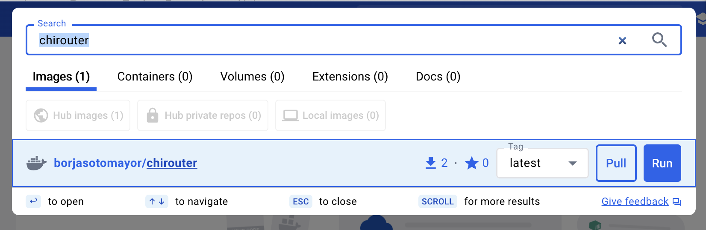
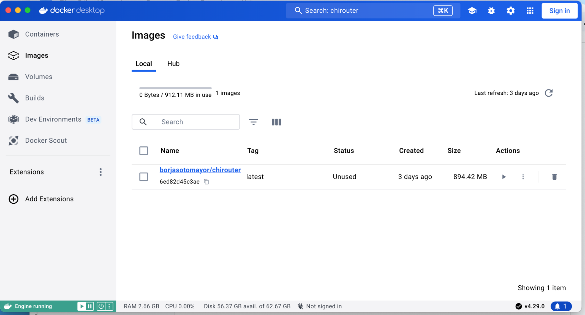
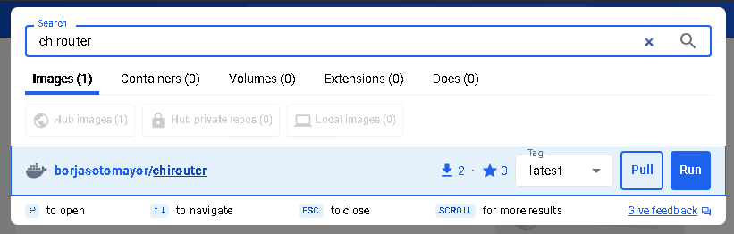
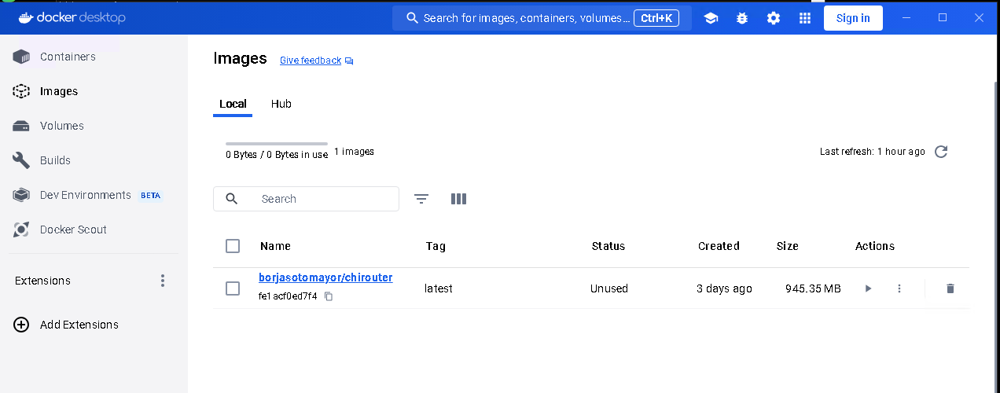

.. _chirouter-installing:

Installing, Building, and Running chirouter
===========================================

The source code for chirouter can be found in the following GitHub repository:

https://github.com/uchicago-cs/chirouter

To work on the assignments, all you need to do is clone this repository. However,
please note that your instructor may give you more specific instructions on how
to get the chirouter code.

Building chirouter
------------------

To build chirouter, the only requirement is `CMake <https://cmake.org/>`__ (version 3.5.1 or higher).

The first time you download the chirouter code to your machine, you must run the
following from the root of the chirouter code tree::

    cmake -B build/

This will generate a number of files necessary to build chirouter.

Once you have done this, simply run ``make`` inside the ``build`` directory
to build chirouter. This will generate the ``chirouter`` executable.

This executable accepts the following parameters:

* ``-p PORT``: [Optional] Port that chirouter will listen on (mininet and POX will use this port
  to send the router its configuration information). Defaults to 23300.
* ``-c FILE``: [Optional] When specified, produces a capture file (in PCAPNG format) with all
  the Ethernet frames sent/received by the routers. This file can be opened in Wireshark for analysis.
* ``-v``, ``-vv``, or ``-vvv``: To control the level of logging. This is described in
  more detail in :ref:`chirouter-implementing`

Installing the chirouter Docker container
-----------------------------------------------------

chirouter depends on the `mininet <http://mininet.org/>`__ network emulator to simulate the conditions of a real network.
While it is technically possible to install mininet by itself, it is much easier to run a Docker container
with all the necessary software. We provide such a container, and provide instructions below on how to install
it and run it.

Before performing these steps, make sure that you have built chirouter as described above.

MacOS / Linux
~~~~~~~~~~~~~

First of all, you will need to install Docker
Desktop on `Mac <https://docs.docker.com/desktop/install/mac-install/>`__
or `Linux <https://docs.docker.com/desktop/setup/install/linux/>`__. You
may be prompted to “sign up” for a Docker account. You are welcome to do
so, but none of the steps below require a Docker account (you can just
click on “Continue without signing in” when prompted to sign up for an
account)

Once you’ve installed Docker Desktop, open it and, on the search bar,
type in “chirouter”:

Click the “Pull” button next to “borjasotomayor/chirouter”

Once the download is complete, you should see the image appear in the
“Images” section on Docker Desktop:

Next, open two terminal windows. On the first terminal window, go to the
``build`` directory of your repository, and run the following:

::

   ./chirouter -vv

You should see the following:

::

   [2024-04-30 14:18:38]   INFO Waiting for connection from controller...

On the second terminal, run the following from the root of your
repository:

::

   ./run-docker basic

You should see the following:

::

   *** Error setting resource limits. Mininet's performance may be affected.
   *** Creating network
   *** Adding controller
   *** Adding hosts:
   client1 client2 server1 server2
   *** Adding switches:
   r1 s1001 s1002 s1003
   *** Adding links:
   (client1, s1003) (client2, s1003) (r1, s1001) (r1, s1002) (r1, s1003) (server1, s1001) (server2, s1002)
   *** Configuring hosts
   client1 client2 server1 server2
   *** Starting SimpleHTTPServer on host server1
   *** Starting SimpleHTTPServer on host server2
   *** Starting controller
   c0
   *** Starting 4 switches
   r1 s1001 s1002 s1003 ...
   *** Starting CLI:
   mininet>

If you look at the first terminal, you should see the following output:

::

   [2024-04-30 14:19:35]   INFO Controller connected from ::ffff:127.0.0.1:52167
   [2024-04-30 14:19:35]   INFO Received 1 routers
   [2024-04-30 14:19:35]   INFO --------------------------------------------------------------------------------
   [2024-04-30 14:19:35]   INFO ROUTER r1
   [2024-04-30 14:19:35]   INFO
   [2024-04-30 14:19:35]   INFO eth1 BE:BA:81:AC:7D:8F 192.168.1.1
   [2024-04-30 14:19:35]   INFO eth2 5A:42:D3:55:91:5A 172.16.0.1
   [2024-04-30 14:19:35]   INFO eth3 CA:43:81:D1:0B:82 10.0.0.1
   [2024-04-30 14:19:35]   INFO
   [2024-04-30 14:19:35]   INFO Destination     Gateway         Mask            Iface
   [2024-04-30 14:19:35]   INFO 192.168.0.0     0.0.0.0         255.255.0.0     eth1
   [2024-04-30 14:19:35]   INFO 172.16.0.0      0.0.0.0         255.255.240.0   eth2
   [2024-04-30 14:19:35]   INFO 10.0.0.0        0.0.0.0         255.0.0.0       eth3
   [2024-04-30 14:19:35]   INFO --------------------------------------------------------------------------------

Note: The MAC addresses will be different, but everything else should
look as it does above.

To exit the mininet prompt in the first terminal, press Control-D

Next up, skip to the "General" section below.

Windows
~~~~~~~

First of all, you will need to `install Docker
Desktop <https://docs.docker.com/desktop/install/windows-install/>`__.

.. note::

    Docker can be run on Windows in one of two modes: WSL2 or
    Hyper-V. The default WSL2 **does not** support mininet, so
    you will need to setup Docker to use Hyper-V instead. When
    prompted to use WSL2, make sure that option is unchecked:

    .. figure:: docker-windows-1.png

    Docker Desktop may ask you at various points whether you want to switch
    to using WSL2. Remember to always decline that option.

    That said, in some setups (e.g., Windows Home), Docker may tell
    you that WSL2 is the only option available (additionally, you
    may get better performance from using WSL2). In that case,
    you will need to update your WSL2 kernel to be able to run our Docker container. We provide instructions
    for this at the end of this section.

After Docker Desktop has finished installing (this may include
restarting your computer), open it. You may be prompted to “sign up” for
a Docker account. You are welcome to do so, but none of the steps below
require a Docker account (you can just click on “Continue without
signing in” when prompted to sign up for an account)

Next, type in “chirouter” on the Docker Desktop search bar:

Click the “Pull” button next to “borjasotomayor/chirouter”

Once the download is complete, you should see the image appear in the
“Images” section on Docker Desktop:

Next, open two terminals: a WSL2 terminal and a PowerShell terminal.

On the WSL2 terminal, go to the ``build`` directory of your repository, and
run the following:

::

   ./chirouter -vv

You should see the following:

::

   [2024-04-30 14:18:38]   INFO Waiting for connection from controller…

Then, on the PowerShell terminal, run the following:

::

   docker.exe run -ti --rm --privileged --name chirouter --add-host=host.docker.internal:host-gateway borjasotomayor/chirouter basic

Note: To avoid running that command every time, you can also create a
file called ``run-docker.ps1`` with the following contents:

::

   docker.exe run -ti --rm --privileged --name chirouter --add-host=host.docker.internal:host-gateway borjasotomayor/chirouter $args

Then, run the following:

::

   .\run-docker.ps1 basic

You should see the following output:

::

   *** Error setting resource limits. Mininet's performance may be affected.
   *** Creating network
   *** Adding controller
   *** Adding hosts:
   client1 client2 server1 server2
   *** Adding switches:
   r1 s1001 s1002 s1003
   *** Adding links:
   (client1, s1003) (client2, s1003) (r1, s1001) (r1, s1002) (r1, s1003) (server1, s1001) (server2, s1002)
   *** Configuring hosts
   client1 client2 server1 server2
   *** Starting SimpleHTTPServer on host server1
   *** Starting SimpleHTTPServer on host server2
   *** Starting controller
   c0
   *** Starting 4 switches
   r1 s1001 s1002 s1003 ...
   *** Starting CLI:
   mininet>

On the WSL2 terminal, you should see the following:

::

   [2024-04-30 21:44:02]   INFO Controller connected from 127.0.0.1:48598
   [2024-04-30 21:44:02]   INFO Received 1 routers
   [2024-04-30 21:44:02]   INFO --------------------------------------------------------------------------------
   [2024-04-30 21:44:02]   INFO ROUTER r1
   [2024-04-30 21:44:02]   INFO
   [2024-04-30 21:44:02]   INFO eth1 C6:CC:B6:5B:C7:8B 192.168.1.1
   [2024-04-30 21:44:02]   INFO eth2 C2:AB:30:7A:99:63 172.16.0.1
   [2024-04-30 21:44:02]   INFO eth3 16:57:6A:8D:AD:0D 10.0.0.1
   [2024-04-30 21:44:02]   INFO
   [2024-04-30 21:44:02]   INFO Destination     Gateway         Mask            Iface
   [2024-04-30 21:44:02]   INFO 192.168.0.0     0.0.0.0         255.255.0.0     eth1
   [2024-04-30 21:44:02]   INFO 172.16.0.0      0.0.0.0         255.255.240.0   eth2
   [2024-04-30 21:44:02]   INFO 10.0.0.0        0.0.0.0         255.0.0.0       eth3
   [2024-04-30 21:44:02]   INFO --------------------------------------------------------------------------------

Note: The MAC addresses will be different, but everything else should
look as it does above.

To exit the mininet prompt in the first terminal, press Control-D

Next up, skip to the "Running chirouter" section below.

**Updating the WSL2 Kernel**

If you want to run our Docker container in WSL2 mode, you will need to build a new WSL2 kernel
(the default WSL2 kernel does not include the Open vSwitch module needed to run mininet).
You can do so by following the instructions on `this page <https://learn.microsoft.com/en-us/community/content/wsl-user-msft-kernel-v6>`__.

IMPORTANT: Between steps 4 and 5 of the linked instructions, you need to run the following command::

    make menuconfig KCONFIG_CONFIG=Microsoft/config-wsl

Then navigate to ``Networking support -> Networking Options -> Open vSwitch``, and make sure it is
compiled into the kernel (make sure the option appears as ``<*> Open vSwitch``)

Running chirouter
-----------------

Running chirouter involves running the ``chirouter`` executable in one terminal,
and mininet (using the Docker container) in another terminal. To do this,
follow the same instructions describe above when installing the Docker container.

The first parameter to the ``run-docker`` script specifies the network topology
we want to simulate:

- MacOS/Linux::

    ./run-docker basic

- Windows::

    .\run-docker.ps1 basic

These topologies are described in more detail in the :ref:`chirouter-testing`
page but, for now, all we need to know is that the ``basic`` topology involves
a single router connecting multiple networks together, each containing some hosts.

The mininet terminal (which will show a prompt like this: ``mininet>``)
will allow you to run network commands on a specific host of the topology. For example,
this::

   mininet> client1 ping -c 4 server1

Would run the ``ping`` command on ``client1`` (and would specifically
ping ``server1`` four times). While the network itself is being simulated
by Mininet, the commands that are being run are the exact same ones you
would run on a Linux system.

Please note that the above command won't yet work, because you have not
yet implemented the router. However, to verify that mininet is running correctly,
you can run the following::

   mininet> client1 ping -c 4 client1
   PING 10.0.100.1 (10.0.100.1) 56(84) bytes of data.
   64 bytes from 10.0.100.1: icmp_seq=1 ttl=64 time=0.018 ms
   64 bytes from 10.0.100.1: icmp_seq=2 ttl=64 time=0.014 ms
   64 bytes from 10.0.100.1: icmp_seq=3 ttl=64 time=0.022 ms
   64 bytes from 10.0.100.1: icmp_seq=4 ttl=64 time=0.023 ms
   
   --- 10.0.100.1 ping statistics ---
   4 packets transmitted, 4 received, 0% packet loss, time 2999ms
   rtt min/avg/max/mdev = 0.014/0.019/0.023/0.004 ms

The above command just instructs ``client1`` to ping itself. Since your router isn't involved in delivering the
messages, this will run fine even if you haven't implemented the router yet. On the other hand, the following
command instructs ``client1`` to ping ``10.0.0.1`` (one of the router's interfaces). Since you have
not yet implemented your router, it will not reply to the pings::

   mininet> client1 ping -c 4 10.0.0.1
   PING 10.0.0.1 (10.0.0.1) 56(84) bytes of data.
   From 10.0.100.1 icmp_seq=1 Destination Host Unreachable
   From 10.0.100.1 icmp_seq=2 Destination Host Unreachable
   From 10.0.100.1 icmp_seq=3 Destination Host Unreachable
   From 10.0.100.1 icmp_seq=4 Destination Host Unreachable
   
   --- 10.0.0.1 ping statistics ---
   4 packets transmitted, 0 received, +4 errors, 100% packet loss, time 3014ms

However, if you look at the chirouter logs, you should see that it *is* receiving ARP requests from ``client1``::

    [2022-02-18 18:18:21]  DEBUG Received Ethernet frame on interface r1-eth3
    [2022-02-18 18:18:21]  DEBUG    ######################################################################
    [2022-02-18 18:18:21]  DEBUG <  Src: 26:0F:6D:1B:55:DD
    [2022-02-18 18:18:21]  DEBUG <  Dst: FF:FF:FF:FF:FF:FF
    [2022-02-18 18:18:21]  DEBUG <  Ethertype: 0806 (ARP)
    [2022-02-18 18:18:21]  DEBUG <  Payload (28 bytes):
    [2022-02-18 18:18:21]  DEBUG   0000  00 01 08 00 06 04 00 01 26 0f 6d 1b 55 dd 0a 00  ........&.m.U...
    [2022-02-18 18:18:21]  DEBUG   0010  64 01 00 00 00 00 00 00 0a 00 00 01              d...........
    [2022-02-18 18:18:21]  DEBUG    ######################################################################

As you develop your router, please note that it is important that you start chirouter and mininet in
the same order: chirouter first, followed by mininet.

Running without a topology
~~~~~~~~~~~~~~~~~~~~~~~~~~

If you run ``run-docker`` without any parameters, you will instead get a
root shell in the container::

   $ ./run-docker
   root@e37390d6efd7:/chirouter#

You will need to do this to run the automated tests, which are described
later in this documentation.

Inside this root shell, you can run also run a ``run-mininet`` command directly
to start Mininet::

       $ ./run-docker
       root@e37390d6efd7:/chirouter# ./run-mininet topologies/basic.json
       *** Error setting resource limits. Mininet's performance may be affected.
       *** Creating network
       *** Adding controller
       *** Adding hosts:
       client1 client2 server1 server2
       … etc …

**CAREFUL**: When you exit this root shell, any work you did inside the container
will be lost. You should only use the container to run mininet or the automated tests;
you should not be creating and saving any files inside the container.

Finally, chirouter listens on port 23320 for connections from mininet
(and mininet will, by default, use that port). Since you will be running
on your own computer, this should not cause any conflicts but, if you do
need to use a different port, run chirouter like this::

   ./chirouter -p PORT

(where ``PORT`` is the alternate port you want to use)

And, from the container’s root shell, run this::

   ./run-mininet topologies/basic.json --chirouter host.docker.internal:PORT
