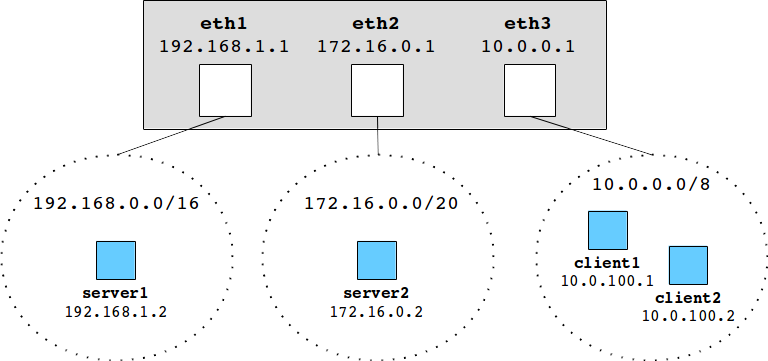
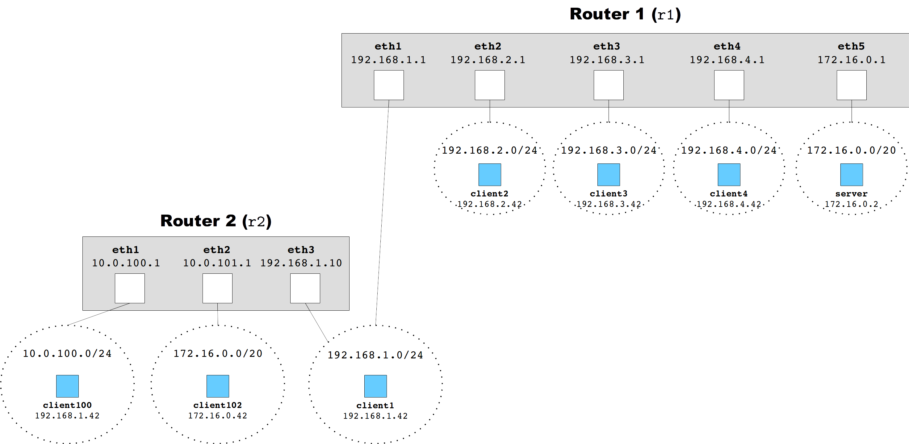
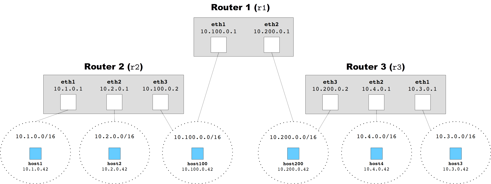

.. _chirouter-testing:

Testing your Implementation
===========================

chirouter currently does not have automated tests, and all testing is done manually
from the mininet command-line interface (CLI). However, we provide a suggested order of
implementation that will allow you to verify that certain components of the router
are working correctly before moving on to other components.

We will start by using a basic network topology with a single router, and then
move on to more complex network topologies with multiple routers.

Basic Topology
--------------

To begin testing your router, you will use the ``basic.json`` topology file when
running mininet. This will simulate the following network topology:

   
This means your router will have three interfaces, each connected to a
network. The routing table for the router will be the following:: 

   Destination     Gateway         Mask            Iface           
   192.168.0.0     0.0.0.0         255.255.0.0     eth1            
   172.16.0.0      0.0.0.0         255.255.240.0   eth2            
   10.0.0.0        0.0.0.0         255.0.0.0       eth3            

Notice how the topology also defines four hosts (``server1``, ``server2``,
``client1``, and ``client2``). Using the mininet CLI, you will be able
to run standard network commands (such as ping, traceroute, etc.) from those
hosts.

Responding to ARP requests
--------------------------

Your very first task will be to respond to ARP requests. Otherwise, the other
devices on the network will be unable to send you IP datagrams.

To test whether you are generating correct ARP replies, you can run the following
from mininet::

   mininet> client1 ping -c 4 10.0.0.1
   
At this point, ping will not work (since you haven't implemented ICMP yet), but this
will make ``client1`` send an ARP request for 10.0.0.1 (the IP address for the
router's ``eth3`` interface). If you generate a correct ARP
reply, the reply will be stored in client1's ARP cache. You can see the state of this
cache by running ``arp -n`` in ``client1``. If your ARP reply was successful, you
will see and entry for ``10.0.0.1`` (the MAC address will likely be different when
you run it)::

   mininet> client1 arp -n
   Address                  HWtype  HWaddress           Flags Mask            Iface
   10.0.0.1                 ether   e2:37:3d:e5:c5:29   C                     client1-eth0

Note: ``client1``'s ARP cache is completely distinct from the one you're implementing. ``client1``
represents a computer on the network, and is completely simulated by mininet. You are implementing
the router, which has its own ARP cache (and which you cannot query or see from the mininet
CLI).
    
Responding to ICMP requests directed to the router
--------------------------------------------------

Next, implement the functionality described in :ref:`chirouter-assignment-icmp` and, 
specifically, the one that doesn't require supporting ARP. When you receive a message
that triggers one of the ICMP responses described in that section of the assignment,
you can simply use the source Ethernet address as the destination address of the reply.

To test whether you're responding to Echo Replies correctly, just ping the router like
this::

   mininet> client1 ping -c 4 10.0.0.1
   PING 10.0.0.1 (10.0.0.1) 56(84) bytes of data.
   84 bytes from 10.0.0.1: icmp_seq=1 ttl=255 time=22.3 ms
   84 bytes from 10.0.0.1: icmp_seq=2 ttl=255 time=3.19 ms
   84 bytes from 10.0.0.1: icmp_seq=3 ttl=255 time=20.5 ms
   84 bytes from 10.0.0.1: icmp_seq=4 ttl=255 time=38.3 ms
   
   --- 10.0.0.1 ping statistics ---
   4 packets transmitted, 4 received, 0% packet loss, time 3003ms
   rtt min/avg/max/mdev = 3.197/21.120/38.381/12.460 ms

**Note**: If for this ping command (or any other ping commands listed on this page),
you get ``64 bytes from`` instead of ``84 bytes from``, that is still considered correct.

To test whether you're generating ICMP Host Unreachable messages correctly, ping one
of the router's *other* IP addresses::

   mininet> client1 ping -c 4 192.168.1.1
   PING 192.168.1.1 (192.168.1.1) 56(84) bytes of data.
   From 10.0.0.1 icmp_seq=1 Destination Host Unreachable
   From 10.0.0.1 icmp_seq=2 Destination Host Unreachable
   From 10.0.0.1 icmp_seq=3 Destination Host Unreachable
   From 10.0.0.1 icmp_seq=4 Destination Host Unreachable
   
   --- 192.168.1.1 ping statistics ---
   4 packets transmitted, 0 received, +4 errors, 100% packet loss, time 3005ms

To check whether you're generating ICMP Time Exceeded messages correctly, run
the following::

   mininet> client1 ping -c 4 -t 1 10.0.0.1
   PING 10.0.0.1 (10.0.0.1) 56(84) bytes of data.
   From 10.0.0.1 icmp_seq=1 Time to live exceeded
   From 10.0.0.1 icmp_seq=2 Time to live exceeded
   From 10.0.0.1 icmp_seq=3 Time to live exceeded
   From 10.0.0.1 icmp_seq=4 Time to live exceeded
   
   --- 10.0.0.1 ping statistics ---
   4 packets transmitted, 0 received, +4 errors, 100% packet loss, time 3005ms

To test whether you're generating ICMP Port Unreachable messages correctly, try
tracerouting the router::

   mininet> client1 traceroute 10.0.0.1
   traceroute to 10.0.0.1 (10.0.0.1), 30 hops max, 60 byte packets
    1  10.0.0.1 (10.0.0.1)  17.487 ms  17.826 ms  17.825 ms

Note: ``traceroute`` may seem to hang at first. This is normal: it just takes longer to run than
other commands.

Traceroute actually uses UDP packets where the IP datagram has increasingly larger TTLs.
This means that intermediate hops will return a Time Limit Exceeded response, and the
destination host will return a Port Unreachable when the IP datagram has the TTL
set to the right number of hops.

Sending ARP requests and processing ARP replies
-----------------------------------------------

To test that you can send ARP requests correctly, and can process ARP replies correctly,
but without having to deal with IP forwarding or with timing out pending ARP requests
that have been sent too many times, write your forwarding logic with the following
assumptions:

#. You only forward IP datagrams to ``server1``, and you can hardcode the Ethernet
   interface that reaches that network (i.e., you don't have to look anything up
   in the routing table). However, you will still rely on sending an ARP request
   to find ``server1``'s MAC address.
#. When you send an ARP request for ``server1``, you don't add a pending ARP request 
   to the pending ARP request list, but you *do* add entries to the ARP cache if you receive
   an ARP reply.
  
This means that, if you ping ``server1``, the first ICMP messages will be lost
(because we're not storing them in the withheld frames list of a pending ARP
request) but, as soon as we receive an ARP reply and add the MAC address to the
ARP cache, you will be able to deliver those IP datagrams.

For example, you can try running this::

   mininet> client1 ping -c 4 server1
   PING 192.168.1.2 (192.168.1.2) 56(84) bytes of data.
   64 bytes from 192.168.1.2: icmp_seq=3 ttl=63 time=18.7 ms
   64 bytes from 192.168.1.2: icmp_seq=4 ttl=63 time=49.0 ms
   
   --- 192.168.1.2 ping statistics ---
   4 packets transmitted, 2 received, 50% packet loss, time 3019ms
   rtt min/avg/max/mdev = 18.739/33.883/49.028/15.145 ms

Notice how the first two ICMP messages are not received, but the remaining two are (Note:
the exact number of delivered/undelivered messages may vary when you run this).

IP forwarding
-------------

Next, remove the first assumption we listed above. Instead of assuming you're only
dealing with messages going to ``server1``, you must be able to deal with any IP
datagram. However, you do not yet have to support gateways, nor implement Longest
Prefix Match (as there will always be at most one match in the routing table)

This means that, if you ping ``server2`` instead of ``server1``, your router must be
able to send the ICMP messages to the right network (but, like above, the first messages
will be lost while you wait to get an ARP reply).

Also, at this point, you must be able to send ICMP Network Unreachable messages if
you get an IP datagram for a network that doesn't match any entry in the routing table.
For example::

   mininet> client1 ping -c 4 8.8.8.8
   PING 8.8.8.8 (8.8.8.8) 56(84) bytes of data.
   From 10.0.0.1 icmp_seq=1 Destination Net Unreachable
   From 10.0.0.1 icmp_seq=2 Destination Net Unreachable
   From 10.0.0.1 icmp_seq=3 Destination Net Unreachable
   From 10.0.0.1 icmp_seq=4 Destination Net Unreachable
   
   --- 8.8.8.8 ping statistics ---
   4 packets transmitted, 0 received, +4 errors, 100% packet loss, time 3004ms

Handling ARP pending requests
-----------------------------

Now, we remove the second assumption. When you send an ARP request, you must create
a pending ARP request. All the IP datagrams that are waiting for the outcome of that
ARP request must be stored in the pending request's list of withheld frames and,
when and ARP reply arrives, you must forward those IP datagrams. However,
you do not need to worry about re-sending ARP requests or timing out requests
that have been sent too many times (since we are going to access hosts that we
know exist on each network).

That means you must now be able to ping the two servers without any message losses::

   mininet> client1 ping -c 4 server1
   PING 192.168.1.2 (192.168.1.2) 56(84) bytes of data.
   64 bytes from 192.168.1.2: icmp_seq=1 ttl=63 time=21.7 ms
   64 bytes from 192.168.1.2: icmp_seq=2 ttl=63 time=48.2 ms
   64 bytes from 192.168.1.2: icmp_seq=3 ttl=63 time=29.2 ms
   64 bytes from 192.168.1.2: icmp_seq=4 ttl=63 time=10.3 ms
   
   --- 192.168.1.2 ping statistics ---
   4 packets transmitted, 4 received, 0% packet loss, time 3005ms
   rtt min/avg/max/mdev = 10.353/27.408/48.246/13.791 ms

   mininet> client1 ping -c 4 server2
   PING 172.16.0.2 (172.16.0.2) 56(84) bytes of data.
   64 bytes from 172.16.0.2: icmp_seq=1 ttl=63 time=55.3 ms
   64 bytes from 172.16.0.2: icmp_seq=2 ttl=63 time=33.8 ms
   64 bytes from 172.16.0.2: icmp_seq=3 ttl=63 time=19.5 ms
   64 bytes from 172.16.0.2: icmp_seq=4 ttl=63 time=49.6 ms

You should also be able to reach the web servers that are running on those servers:: 

   mininet> client1 wget -q -O - http://192.168.1.2/
   <html>
   <head><title> This is server1</title></head>
   <body>
   Congratulations!  
   Your router successfully routes your packets to and from server1. 
   </body>
   </html>

   mininet> client1 wget -q -O - http://172.16.0.2/
   <html>
   <head><title> This is server2</title></head>
   <body>
   Congratulations!  
   Your router successfully routes your packets to and from server2. 
   </body>
   </html>

And you should be able to traceroute the servers::

   mininet> client1 traceroute -n server1
   traceroute to 192.168.1.2 (192.168.1.2), 30 hops max, 60 byte packets
    1  10.0.0.1 (10.0.0.1)  105.121 ms  108.790 ms  172.695 ms
    2  192.168.1.2 (192.168.1.2)  242.927 ms  306.856 ms  306.985 ms

To ensure that your implementation is correct, and that it doesn't happen to work
because your router had cached an earlier reply, you should run each of the above
with a freshly started router.

If you get sporadic timeouts in the traceroute output, try running traceroute
as follows::

    client1 traceroute -w 10 -z 100 -n server1

This will introduce 100ms delay between probes, and will wait 10s for replies.
While you may want to determine why your code requires higher timeouts,
running traceroute with the above parameters is also acceptable.

Timing out pending ARP requests
-------------------------------

Finally, you should implement the ``chirouter_arp_process_pending_req`` function
to re-send ARP requests, and to detect when an ARP request has been sent too many
times. When this happens, you must send an ICMP Host Unreachable message in reply
to each withheld frame. This means that if you ping a host that doesn't exist
(but which is in one of the networks that the router is connected to), the 
following should happen::

   mininet> client1 ping -c 4 192.168.1.3
   PING 192.168.1.3 (192.168.1.3) 56(84) bytes of data.
   From 10.0.0.1 icmp_seq=1 Destination Host Unreachable
   From 10.0.0.1 icmp_seq=2 Destination Host Unreachable
   From 10.0.0.1 icmp_seq=3 Destination Host Unreachable
   From 10.0.0.1 icmp_seq=4 Destination Host Unreachable
   
   --- 192.168.1.3 ping statistics ---
   4 packets transmitted, 0 received, +4 errors, 100% packet loss, time 2999ms

The Two Router Topology
-----------------------

The ``2router.json`` file specifies a topology with two routers:

The routing table for Router 1 is::

   Destination     Gateway         Mask            Iface           
   192.168.1.0     0.0.0.0         255.255.255.0   eth1            
   192.168.2.0     0.0.0.0         255.255.255.0   eth2            
   192.168.3.0     0.0.0.0         255.255.255.0   eth3            
   192.168.4.0     0.0.0.0         255.255.255.0   eth4            
   172.16.0.0      0.0.0.0         255.255.240.0   eth5            
   10.0.0.0        192.168.1.10    255.0.0.0       eth1            

And the routing table for Router 2 is::

   Destination     Gateway         Mask            Iface           
   10.0.100.0      0.0.0.0         255.255.255.0   eth1            
   10.0.101.0      0.0.0.0         255.255.255.0   eth2            
   192.168.1.0     0.0.0.0         255.255.255.0   eth3            
   0.0.0.0         192.168.1.1     0.0.0.0         eth3            

This topology will allow you to test whether you have implemented gateway routes
correctly, as well as Longest Prefix Match when searching for a matching entry
in the table. If implemented correctly, you should be able to ping from ``client100``
to ``server``::

   mininet> client100 ping -c 4 server
   PING 172.16.0.2 (172.16.0.2) 56(84) bytes of data.
   64 bytes from 172.16.0.2: icmp_seq=1 ttl=62 time=22.0 ms
   64 bytes from 172.16.0.2: icmp_seq=2 ttl=62 time=14.3 ms
   64 bytes from 172.16.0.2: icmp_seq=3 ttl=62 time=21.1 ms
   64 bytes from 172.16.0.2: icmp_seq=4 ttl=62 time=47.0 ms
   
   --- 172.16.0.2 ping statistics ---
   4 packets transmitted, 4 received, 0% packet loss, time 3003ms
   rtt min/avg/max/mdev = 14.397/26.179/47.084/12.428 ms

Ping from ``server`` to ``client100``::

   mininet> server ping -c 4 client100
   PING 10.0.100.42 (10.0.100.42) 56(84) bytes of data.
   64 bytes from 10.0.100.42: icmp_seq=1 ttl=62 time=40.5 ms
   64 bytes from 10.0.100.42: icmp_seq=2 ttl=62 time=15.6 ms
   64 bytes from 10.0.100.42: icmp_seq=3 ttl=62 time=41.2 ms
   64 bytes from 10.0.100.42: icmp_seq=4 ttl=62 time=16.5 ms
   
   --- 10.0.100.42 ping statistics ---
   4 packets transmitted, 4 received, 0% packet loss, time 3004ms
   rtt min/avg/max/mdev = 15.620/28.472/41.226/12.413 ms

Traceroute from one to the other::

   mininet> client100 traceroute server
   traceroute to 172.16.0.2 (172.16.0.2), 30 hops max, 60 byte packets
    1  10.0.100.1 (10.0.100.1)  46.325 ms  46.805 ms  46.789 ms
    2  192.168.1.1 (192.168.1.1)  93.086 ms  100.558 ms  99.434 ms
    3  172.16.0.2 (172.16.0.2)  100.553 ms  102.179 ms  136.987 ms
   mininet> server traceroute client100
   traceroute to 10.0.100.42 (10.0.100.42), 30 hops max, 60 byte packets
    1  172.16.0.1 (172.16.0.1)  39.088 ms  39.699 ms  39.682 ms
    2  192.168.1.10 (192.168.1.10)  57.754 ms  92.252 ms  90.556 ms
    3  10.0.100.42 (10.0.100.42)  92.981 ms  158.096 ms  160.074 ms

And access the web server on ``server`` from ``client100``::

   mininet> client100 wget -q -O - http://172.16.0.2/
   <html>
   <head><title> This is server</title></head>
   <body>
   Congratulations!  
   Your router successfully routes your packets to and from server. 
   </body>
   </html>

The Three Router Topology
-------------------------

The ``3router.json`` file specifies a topology with three routers:

The routing table for Router 1 is::

    Destination     Gateway         Mask            Iface           
    10.1.0.0        10.100.0.2      255.255.0.0     eth1            
    10.2.0.0        10.100.0.2      255.255.0.0     eth1            
    10.100.0.0      0.0.0.0         255.255.0.0     eth1            
    10.3.0.0        10.200.0.2      255.255.0.0     eth2            
    10.4.0.0        10.200.0.2      255.255.0.0     eth2            
    10.200.0.0      0.0.0.0         255.255.0.0     eth2               

The routing table for Router 2 is::

    Destination     Gateway         Mask            Iface           
    10.1.0.0        0.0.0.0         255.255.0.0     eth1            
    10.2.0.0        0.0.0.0         255.255.0.0     eth2            
    10.100.0.0      0.0.0.0         255.255.0.0     eth3            
    10.0.0.0        10.100.0.1      255.0.0.0       eth3       

And the routing table for Router 3 is::

    Destination     Gateway         Mask            Iface           
    10.3.0.0        0.0.0.0         255.255.0.0     eth1            
    10.4.0.0        0.0.0.0         255.255.0.0     eth2            
    10.200.0.0      0.0.0.0         255.255.0.0     eth3            
    10.0.0.0        10.200.0.1      255.0.0.0       eth3     
     
If your implementation works with the 2-router topology, it is likely that it
will also work with this 3-router topology. However, this topology serves
as a final check that you didn't hardwire anything in your router in a way
that just happens to work when there is only one or two routers.

If implemented correctly, you should be able to ping from ``host1``
to ``host100`` (this tests whether you've implemented Longest Prefix Match correctly)::

    mininet> host1 ping -c 4 host100
    PING 10.100.0.42 (10.100.0.42) 56(84) bytes of data.
    64 bytes from 10.100.0.42: icmp_seq=1 ttl=63 time=167 ms
    64 bytes from 10.100.0.42: icmp_seq=2 ttl=63 time=101 ms
    64 bytes from 10.100.0.42: icmp_seq=3 ttl=63 time=87.0 ms
    64 bytes from 10.100.0.42: icmp_seq=4 ttl=63 time=86.8 ms

    --- 10.100.0.42 ping statistics ---
    4 packets transmitted, 4 received, 0% packet loss, time 3004ms
    rtt min/avg/max/mdev = 86.804/110.837/167.881/33.479 ms

Note: When running this test, you may encounter this warning in your chirouter logs::

    [2018-02-23 10:19:05]   WARN Received a non-broadcast Ethernet frame with a destination address that doesn't match the interface

The reason for this is that the "switches" in each network actually
behave like hubs. This means that, when ``host100`` sends frames
intended for Router 2's ``eth3`` interface, these will also be received by Router 1's ``eth1`` interface.
You can safely ignore these warnings in this test, but you should not encounter them in
other tests.

Ping from ``host1`` to ``host4`` and viceversa::

    mininet> host1 ping -c 4 host4
    PING 10.4.0.42 (10.4.0.42) 56(84) bytes of data.
    64 bytes from 10.4.0.42: icmp_seq=1 ttl=61 time=55.6 ms
    64 bytes from 10.4.0.42: icmp_seq=2 ttl=61 time=34.9 ms
    64 bytes from 10.4.0.42: icmp_seq=3 ttl=61 time=63.9 ms
    64 bytes from 10.4.0.42: icmp_seq=4 ttl=61 time=44.2 ms

    --- 10.4.0.42 ping statistics ---
    4 packets transmitted, 4 received, 0% packet loss, time 3004ms
    rtt min/avg/max/mdev = 34.916/49.697/63.979/11.033 ms

::

    mininet> host4 ping -c 4 host1
    nohup: appending output to 'nohup.out'
    PING 10.1.0.42 (10.1.0.42) 56(84) bytes of data.
    64 bytes from 10.1.0.42: icmp_seq=1 ttl=61 time=48.7 ms
    64 bytes from 10.1.0.42: icmp_seq=2 ttl=61 time=41.7 ms
    64 bytes from 10.1.0.42: icmp_seq=3 ttl=61 time=21.4 ms
    64 bytes from 10.1.0.42: icmp_seq=4 ttl=61 time=51.8 ms

    --- 10.1.0.42 ping statistics ---
    4 packets transmitted, 4 received, 0% packet loss, time 3005ms
    rtt min/avg/max/mdev = 21.410/40.953/51.891/11.867 ms

Traceroute from ``host1`` to ``host4`` (and viceversa)::

    mininet> host1 traceroute host4
    traceroute to 10.4.0.42 (10.4.0.42), 30 hops max, 60 byte packets
     1  10.1.0.1 (10.1.0.1)  32.651 ms  35.776 ms  35.782 ms
     2  10.100.0.1 (10.100.0.1)  71.554 ms  92.322 ms  107.198 ms
     3  10.200.0.2 (10.200.0.2)  110.819 ms  112.896 ms  152.209 ms
     4  10.4.0.42 (10.4.0.42)  152.219 ms  180.433 ms  178.299 ms

::

    mininet> host4 traceroute host1
    traceroute to 10.1.0.42 (10.1.0.42), 30 hops max, 60 byte packets
     1  10.4.0.1 (10.4.0.1)  22.879 ms  24.029 ms  24.031 ms
     2  10.200.0.1 (10.200.0.1)  78.251 ms  40.859 ms  76.196 ms
     3  10.100.0.2 (10.100.0.2)  82.827 ms  119.647 ms  129.343 ms
     4  10.1.0.42 (10.1.0.42)  167.517 ms  240.325 ms  174.980 ms

And access the web server on ``host4`` from ``host1``::

    mininet> host1 wget -q -O - http://10.4.0.42/
    <html>
    <head><title> This is host4</title></head>
    <body>
    Congratulations!  
    Your router successfully routes your packets to and from host4. 
    </body>
    </html>

