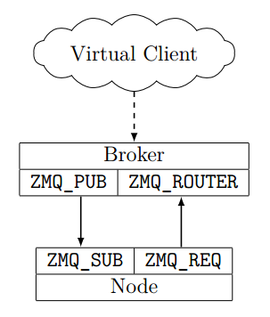

.. _chistributed-architecture:

The chistributed Architecture
=============================

The chistributed architecture is capable of running a number of processes concurrently, and 
simulates a distributed system by allowing those processes to communicate through a central 
message broker. So, instead of communicating directly with each other via sockets, processes 
communicate by sending messages to the message broker, which is responsible for getting the 
message to its destination. This provides a central point for testing all communications 
between nodes, as well as simulating failure conditions in the distributed system.

When implementing a specific distributed system, all you need to do is implement a standalone
program representing a node. Your program must accept a number of command-line parameters
(specified in :ref:`chistributed-implementing`) and must be able to process messages in 
a simple JSON protocol (specified below).

To simulate a system with N nodes, the broker will simply launch N copies of your program. 
Of course, your system may require that some nodes in the system take on specific roles 
(e.g., Proposers vs. Acceptors in a Paxos implementation). Our architecture requires 
that you implement all those roles in the same program; you can then use command-line 
parameters (which you can configure the broker to use when launching your program) 
to make your program run in a specific role.

The message broker is implemented using `ZeroMQ/ØMQ <http://zeromq.org/>`_ , a lightweight 
message queue with support for many topologies and bindings for many programming languages. 
Don't worry if you've never used ZeroMQ (or even message queues) before: the language 
bindings for ZeroMQ provide a simple and very high-level interface (well above the 
socket layer), and there are convenient functions to "send message X to node named A" 
and to "wait for a message".

ZeroMQ topology
---------------

The ZeroMQ topology is depicted below.

.. _chistributed-fig-topology:

   The ZMQ sockets involved in chistributed

Every node in your system connects to the broker with two separate ZeroMQ sockets:

* A ``ZMQ_REQ`` socket connects to the broker's *router* socket. This socket is used to
  **send** messages to the message broker. 
  
  Note that the ZeroMQ API guarantees that a 
  message sent is actually received, unsegmented, by the peer for ``ZMQ_REQ`` sockets. 
  However, it requires that a response be received before another message can be sent on that socket. 
  As such, every message you send on the ``ZMQ_REQ`` socket will receive a response from the broker 
  acknowledging the message (or, in some cases, indicating that an error happened).
  
* A ``ZMQ_SUB`` socket connected to a ``ZMQ_PUB`` socket on the broker. This socket is used to
  **receive** messages to the message broker.

  In particular, all communication from other nodes, or special messages from the broker, will 
  be received on this socket.
  
  
Every node is identified by a string (not by an IP address). So, in this topology, if a node ``Alice``
wishes to send a message to a node ``Bob``, then ``Alice`` will send the message to the broker 
through the ``ZMQ_REQ`` socket, specifying ``Bob`` as the destination. ``Bob`` will then receive 
the message through its ``ZMQ_SUB`` socket.

The exact format of the messages is described below. The specific details on how to configure
the ZeroMQ sockets in your implementation is described in :ref:`chistributed-implementing`.

Virtual Client
--------------

Conceptually, there are also "clients" that send requests to the distributed system. In chistributed,
your distributed system will implement a key-value data store, so the virtual client can only send two types
of requests: a request to *set* a value in the data store, or a request to *get* a value from the data
store. These requests are routed through the message broker, and must be directed to a specific node 
in your system. However, there are no actual client processes; instead, you will be able to 
directly instruct the broker to send *get* and *set* requests to the nodes in your distributed system.

While we define a specific format for these *get* and *set* requests, the semantics
of these operations is up to you. For example, suppose your system can only
provide a stale value in response to a *get* request. Depending on how you designed
your system, this could result in a successful *get* response (because you prefer to
return a stale value to not return any value at all), or an error response (because
you designed your system to only return the latest value, or none at all).

Messages
--------

All messages in chistributed are encoded as a JSON object. For example::

   {"type": "set", 
    "destination": ["proposer2"], 
    "id": 987568098927, 
    "key": "x", 
    "value": "42"}

In this section we describe only the format of the chistributed messages. In :ref:`chistributed-implementing`
we will see that ZeroMQ requires these messages to be further encapsulated in a ZeroMQ-specific data structure.

All messages have at least a ``type`` field to specify the type of message, with additional fields
depending on the type of message. When a message is directed to a specific node (as opposed to
a message directed to the broker itself), the message will also have a ``destination`` field
specifying the node (or nodes) that the message is directed to.

We define three message types that always originate in the broker, and are directed to a
specific node (specified with the ``destination`` field):

* ``hello``: The very first message the broker sends to a node.
* ``get``: Represents a request by a client to get the current value of a given key.
* ``set``: Represents a request by a client to set the value for a given key.

We also define three message types that represent messages from a node to the broker itself (i.e.,
the broker itself is the final recipient of the message; they are not messages that have to be
relayed to another node):

* ``helloResponse``: Sent in response to ``hello``. The broker will not consider a node to be running
  until it receives a ``helloResponse`` from the node. 
* ``getResponse``: Sent in response to a ``get``.
* ``setResponse``: Sent in response to a ``set``.
  
Your implementation can use additional message types. When the broker encounters a message with
a ``type`` that is not listed above, it will simply deliver it to the node(s) specified in the
``destination`` field.

The ``set`` and ``setResponse`` messages
~~~~~~~~~~~~~~~~~~~~~~~~~~~~~~~~~~~~~~~~

The ``set`` message has the following fields:

* ``type``, equal to ``set``.
* ``destination``, set to the node that will process the *set* request. For example, in a Paxos implementation
  it only makes sense to send ``set`` messages to a Proposer node.
* ``id``, set to a unique integer identifier selected by the broker.
* ``key`` and ``value``, used to specify the key and value that will be set by this request.

For example::

   {"type": "set", 
    "destination": ["proposer2"], 
    "id": 3215786, 
    "key": "x", 
    "value": "42"}

When a ``set`` request has been processed, the node which received the ``set`` message must send back
a ``setResponse`` message. If the request was processed correctly, the message will have the following
fields:

* ``type``, set to ``setResponse``.
* ``id``, ``key``, ``value``, with the same values as in the ``set`` request.

For example::

   {"type": "setResponse", 
    "id": 3215786, 
    "key": "x", 
    "value": "42"}

Note that sending a ``setResponse`` does not imply that the *set* operation has been fully completed;
it just implies the request to set a value has been processed correctly (e.g., in an eventually 
consistent data store, you could return a ``setResponse`` once the replication
of the value has begun, but without waiting for it to complete). 

If the request was *not* processed correctly, the message will have the following fields:

* ``type``, set to ``setResponse``.
* ``id``, with the same identifier as in the ``set`` request.
* ``error``, with a descriptive error message.

For example::

   {"type": "setResponse", 
    "id": 3215786, 
    "error": "Could not set x to 42 -- rejected by acceptors"}

The ``get`` and ``getResponse`` messages
~~~~~~~~~~~~~~~~~~~~~~~~~~~~~~~~~~~~~~~~

The ``get`` message has the following fields:

* ``type``, equal to ``get``.
* ``destination``, set to the node that will process the *get* request.
* ``id``, set to a unique integer identifier selected by the broker. Note: The broker will use unique
  identifiers across both sets and gets (i.e., a set operation will never have the same identifier as
  a get operation)
* ``key``, used to specify the key whose value we want to get.

For example::

   {"type": "get", 
    "destination": ["master"], 
    "id": 3215787, 
    "key": "x"}

When a ``get`` request has been processed, the node which received the ``get`` message must send back
a ``getResponse`` message. If the request was processed correctly, the message will have the following
fields:

* ``type``, set to ``getResponse``.
* ``id``, ``key``, with the same values as in the ``get`` request.
* ``value``, with the value associated with key ``key``.

For example::

   {"type": "getResponse", 
    "id": 3215787, 
    "key": "x", 
    "value": "42"}

If the request was *not* processed correctly, the message will have the following fields:

* ``type``, set to ``getResponse``.
* ``id``, with the same identifier as in the ``get`` request.
* ``error``, with a descriptive error message.

For example::

   {"type": "getResponse", 
    "id": 3215787, 
    "error": "No such key: x"}

The ``hello`` and ``helloResponse`` messages
~~~~~~~~~~~~~~~~~~~~~~~~~~~~~~~~~~~~~~~~~~~~

When a new node is started, the broker will first send that node a ``hello`` message with the following fields:

* ``type``, equal to ``hello``.
* ``destination``, set to the node's name.

The node must reply with a ``helloResponse`` message with the following fields:

* ``type``, equal to ``hello``.
* ``source``, set to the node's name.

Sending a ``helloResponse`` to the broker indicates that the node is ready to receive more messages. The broker
will not allow messages to be sent to a node until it receives a ``helloResponse`` message is received
from that node.

Custom messages
~~~~~~~~~~~~~~~

You can define as many additional types of messages as you want. For example::

   {"type": "prepare", 
    "source": "proposer1",
    "destination": ["acceptor1", "acceptor2", "acceptor3"], 
    "proposal_id": 3}

The broker will simply deliver these messages to the nodes specified in the ``destination`` field.

You should, however, take the following into account:

* Whenever you send a message from one node to another to communicate a value, you must use a
  field called ``value``. When simulating Byzantine failures, this is the field that the broker 
  will tamper with in your messages.
* ZeroMQ will not include information about the node who originally sent a given message, so
  you will probably want to include a ``source`` field in all your messages.

