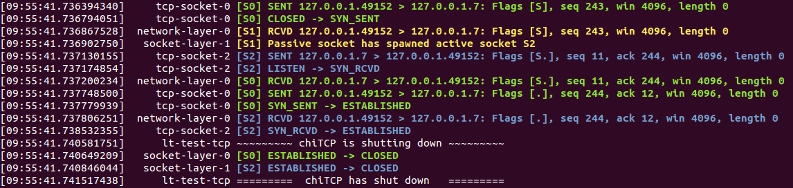
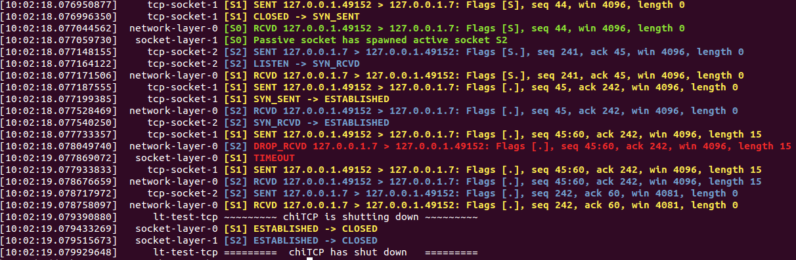
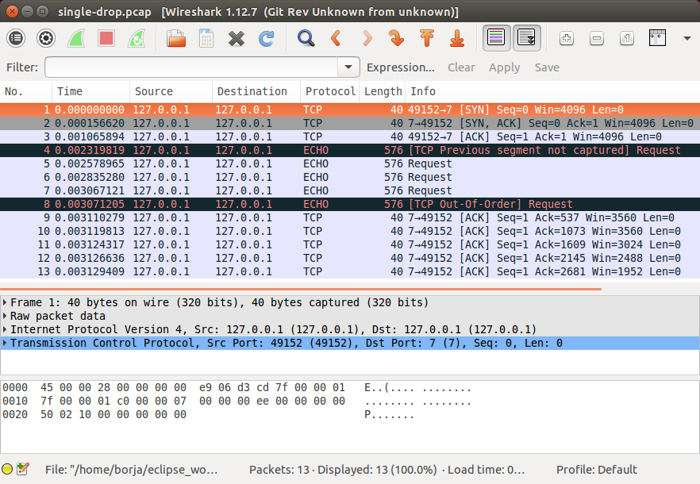
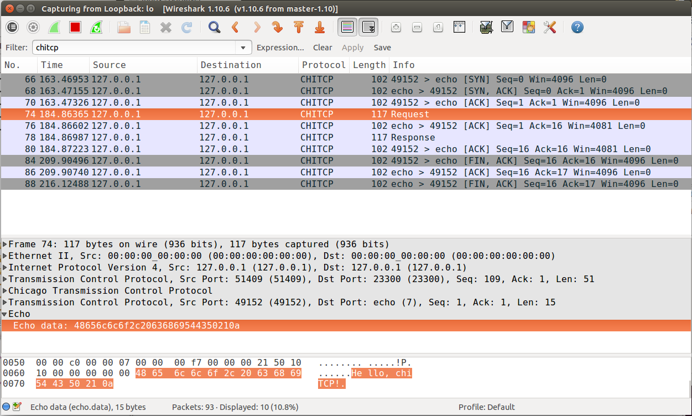

.. _chitcp-testing:

Testing your Implementation
===========================

We provide a number of automated tests and tools that you can use to
test your implementation.

Automated tests
---------------

You can build the automated tests like this::

    make tcptests

Note that this will not run the tests; it will build a ``test-tcp`` executable
in the ``tests/`` directory which you can use to run the tests. Also, take
into account that, if you modify your chiTCP implementation, **you must
rebuild the tests** (i.e., it is not enough to run just ``make``). Otherwise, 
the test executable will not be linked to the latest version of your chiTCP implementation.

The test suite has multiple tests, divided into several categories. You
can see a list of all the tests by running the following::

   tests/test-tcp -l

You can run all the tests by running the following::

   tests/test-tcp
   
Optionally, you can include the ``--verbose`` option to see the progress
of each test.   
   
However, you should not do this until your project is nearly complete: most of
the tests will fail by timing out and, given the high timeouts necessary for
some of the tests, the above command can take a long time to run on an
incomplete project. Instead, you should run the tests individually or
by category.

Running and debugging individual tests
--------------------------------------

To run a single test, simply run the following::

   tests/test-tcp --filter "TEST_CATEGORY/TEST_NAME"

Where ``TEST_CATEGORY`` is the category of the test, and ``TEST_NAME`` is the name
of the test (you can see both of these by running ``tests/test-tcp -l``). For example,
this will run the first connection establishment test::

   tests/test-tcp --filter "conn_init/3way_states"

If the test is succesful, you will see the following::

   [====] Synthesis: Tested: 1 | Passing: 1 | Failing: 0 | Crashing: 0
   
If the test fails an assertion, a message will be printed out. For example::

   [----] tests/test_tcp_conn_init.c:43: Assertion failed: Invalid transition: SYN_SENT -> CLOSED
   
In some tests, you may also see the following::

   [FAIL] conn_init::3way_states: Timed out. (0.50s)
   
This means that the test did not finish running by some specified timeout (in this case, 0.5 seconds).
This usually means your code has gotten stuck somewhere, and is not sending a packet that the
tests were expecting.

When a test fails or times out, you will need to dig deeper to see what your code is
doing during the test. We provide several mechanisms for you to do so.

Minimal logging
~~~~~~~~~~~~~~~

Parsing through all the detailed logging at the ``DEBUG`` and ``TRACE`` levels can be overwhelming,
and it can be hard to sift through so much information. You should first try using chiTCP's 
``MINIMAL`` logging level (the messages at this level are generated directly by chiTCP; you should
never call ``chilog`` with this logging level). The ``MINIMAL`` logging level will log any changes 
of state in a socket, as well as any packets received and sent by a socket (including important information
about the packet, like its sequence number, the size of the payload, etc.). The format is compact
and intended to be easy to read.

To run a test with MINIMAL logging, simply include ``LOG=MINIMAL`` before ``tests/test-tcp``. For example::

   LOG=MINIMAL ./tests/test-tcp --filter "conn_init/3way_states"
   
The output of this test (if successful) would look like this::

   [09:55:41.736394340]     tcp-socket-0 [S0] SENT 127.0.0.1.49152 > 127.0.0.1.7: Flags [S], seq 243, win 4096, length 0
   [09:55:41.736794051]     tcp-socket-0 [S0] CLOSED -> SYN_SENT
   [09:55:41.736867528]  network-layer-0 [S1] RCVD 127.0.0.1.49152 > 127.0.0.1.7: Flags [S], seq 243, win 4096, length 0
   [09:55:41.736902750]   socket-layer-1 [S1] Passive socket has spawned active socket S2
   [09:55:41.737130155]     tcp-socket-2 [S2] SENT 127.0.0.1.7 > 127.0.0.1.49152: Flags [S.], seq 11, ack 244, win 4096, length 0
   [09:55:41.737174854]     tcp-socket-2 [S2] LISTEN -> SYN_RCVD
   [09:55:41.737200234]  network-layer-0 [S0] RCVD 127.0.0.1.7 > 127.0.0.1.49152: Flags [S.], seq 11, ack 244, win 4096, length 0
   [09:55:41.737748500]     tcp-socket-0 [S0] SENT 127.0.0.1.49152 > 127.0.0.1.7: Flags [.], seq 244, ack 12, win 4096, length 0
   [09:55:41.737779939]     tcp-socket-0 [S0] SYN_SENT -> ESTABLISHED
   [09:55:41.737806251]  network-layer-0 [S2] RCVD 127.0.0.1.49152 > 127.0.0.1.7: Flags [.], seq 244, ack 12, win 4096, length 0
   [09:55:41.738532355]     tcp-socket-2 [S2] SYN_RCVD -> ESTABLISHED
   [09:55:41.740581751]      lt-test-tcp ~~~~~~~~~ chiTCP is shutting down ~~~~~~~~~
   [09:55:41.740649209]   socket-layer-0 [S0] ESTABLISHED -> CLOSED
   [09:55:41.740846044]   socket-layer-1 [S2] ESTABLISHED -> CLOSED
   [09:55:41.741517438]      lt-test-tcp =========  chiTCP has shut down   =========

You should ignore the column containing ``tcp-socket-0``, ``network-layer-0``, etc. Instead focus on the ``[S0]``, ``[S1]``, etc.
which tells you what socket is producing this log message. The log message can be either ``SENT`` (the socket sent a packet),
``RCVD`` (the socket received a packet), a state transition (two states separated by ``->``, or a message indicating that
a passive socket has spawned an active socket.

Whe a packet is sent or received, the log message will include the source IP and port, the destination IP and port, the
flags in the TCP header (``S``: SYN, ``F``: FIN, ``.``: ACK), the sequence number, the acknowledgement number,
the advertised window size, and the payload length. Please note that the sequence numbers are likely to be different
that shown in the above output, depending on how you set IRS and ISS.

We also provide a script that will colorize this output for extra readability. Just pipe the output of
the test to ``tests/colorize-minimal.sh``::

   LOG=MINIMAL ./tests/test-tcp --filter "conn_init/3way_states" | tests/colorize-minimal.sh
   
You should see something like this:

In the tests that involve dropping packets, the ``colorize-minimal.sh`` script will highlight dropped
packets and timeouts in red. For example, if we run this::

   LOG=MINIMAL ./tests/test-tcp --filter "unreliable_data_transfer/drop_single_packet" | tests/colorize-minimal.sh
   
The output will look like this:

The ``DROP_RCVD`` message indicates that chiTCP simulated a dropped packet, and ``TIMEOUT`` indicates that
a TCP timeout has happened.   
   
Other logging levels
~~~~~~~~~~~~~~~~~~~~

To have a test print log messages from other log levels, simply set the ``LOG`` variable to the appropriate
level. For example::

   LOG=DEBUG ./tests/test-tcp --filter "conn_init/3way_states"
   
Producing a pcap file
~~~~~~~~~~~~~~~~~~~~~

Instead of reading through the log output, it can be useful to analyze the packets that were actually
sent during the test. chiTCP can produce a "pcap" file that can be opened with Wireshark. This can
help you verify whether all the values in the TCP packets are set to the correct values, since 
Wireshark will "dissect" your TCP packets just like it would any TCP packet (and will highlight any
issues).

To produce a pcap file, simply include ``PCAP=FILENAME`` before ``tests/test-tcp``, replacing
``FILENAME`` with a name for the pcap file. For example, if we ran the following test,
which has packets arrive out of order::

   PCAP=out_of_order.pcap ./tests/test-tcp --filter "unreliable_data_transfer/out_of_order_1"
   
And then open ``out_of_order.pcap`` in Wireshark, we can see that it correctly detects
that one of the packets arrived out of order:

Using gdb to debug a test
~~~~~~~~~~~~~~~~~~~~~~~~~

To run gdb with a single test, you will need to run the test you want to debug in one terminal,
and gdb in a separate terminal. First, run the test like this::

   ./tests/test-tcp --debug=gdb --debug-transport=tcp:PORT --filter "TEST"

Replace ``TEST`` with the test you want to debug, and substitute ``PORT`` with a random port number. 
By default, the tests will use ``1234`` but, if you are on a machine with multiple users, other users 
may be trying to use that port.

Then, on another terminal, run this::

   libtool --mode execute gdb tests/test-tcp

On the GDB prompt, run this::

   target remote localhost:PORT
   
Substituting ``PORT`` with the same port you used earlier.

Now, just use gdb as usual (note that you have to use the ``continue`` command instead
of the ``run`` command to ge the test running)

Running Valgrind on a test
~~~~~~~~~~~~~~~~~~~~~~~~~~

To run Valgrind on a single test, run the following::

   libtool --mode execute valgrind ./tests/test-tcp --filter "TEST"
   
Replace ``TEST`` with the test you want to run.

Running the tests on machines with multiple users
~~~~~~~~~~~~~~~~~~~~~~~~~~~~~~~~~~~~~~~~~~~~~~~~~

The tests internally run the chiTCP daemon which, just like the
regular ``chitcpd`` executable, will need a TCP port and a UNIX socket.
If you are on a machine with multiple users, then more than more
user may try to use the default port (23300). As with ``chitcpd``,
make sure you run the following on any terminal where you run the
tests:: 

   export CHITCPD_PORT=30287  # Substitute for a different number
   export CHITCPD_SOCK=/tmp/chitcpd.socket.$USER

Running categories of tests
---------------------------

To run entire categories of tests, simply run the following:

* TCP connection establishment::

    ./tests/test-tcp --filter "conn_init/*"
  
* TCP connection termination::

    ./tests/test-tcp --filter "conn_term/*"

* TCP data transfer::

    ./tests/test-tcp --filter "data_transfer/*"

* TCP over an unreliable network::

    ./tests/test-tcp --filter "unreliable_conn_init/*"
    ./tests/test-tcp --filter "unreliable_conn_term/*"
    ./tests/test-tcp --filter "unreliable_data_transfer/*"
    
The ``--filter`` option uses regular expressions, so you can further constrain the tests
that will be run. For example, to only run the "echo" tests from the data transfer
tests, you could run the following::

    ./tests/test-tcp --filter "data_transfer/echo*"
    
Echo server and client
----------------------

The automated tests will barrel through all the steps involved in each
particular test, which can make it hard to observe what happens at each
point. When you start developing your TCP implementation, we suggest you 
use the ``echo-server`` and ``echo-client`` sample programs found in the 
``samples`` directory if you need to run through your code
step by step. You can build these samples by running::

    make samples

``echo-server`` and ``echo-client`` are a basic implementation of an echo server
and client. The echo server creates a passive socket on port 7 and, when a
client connects on that port, every byte the client sends will be sent back
verbatim. It is a simple way of testing that basic operations, like connecting
or sending small messages, work correctly.

Take into account that ``echo-server`` and ``echo-client`` both use the *chisocket*
library. This means that you **must** run ``chitcpd`` on the same machine you're running
``echo-server`` and ``echo-client``. Otherwise, the chisocket library will not work.

When testing with these applications, we suggest you run ``chitcpd`` with option
``-vvv``. This will print detailed output about what your TCP implementation is
doing, including changes in the TCP variables. Additionally, you can run
``echo-server`` and ``echo-client`` with a ``-s`` option that will allow you to
"step through" the stages of the TCP connection. For example, if you run
``echo-server -s``, you should step through the following::

    Press any key to create the socket...
    Press any key to bind the socket...
    Press any key to make the socket listen...
    Press any key to accept a connection...

After that last message, the server will block, waiting for connections.

Then, run ``echo-client -s`` and step through the following::

    Press any key to create the socket...
    Press any key to connect to the server... 

As your TCP implementation sends and receives the packets for the three-way
handshake, you should see several messages appear on the ``chitcpd`` log. For
example, if you are sending the SYN packet correctly from the client to the
server, you should see something like this::

     >>> Handling event APPLICATION_CONNECT on state CLOSED
     >>> TCP data BEFORE handling:
        ......................................................
                              CLOSED
     
                 ISS:           0           IRS:           0
             SND.UNA:           0 
             SND.NXT:           0       RCV.NXT:           0 
             SND.WND:           0       RCV.WND:           0 
         Send Buffer:    0 / 4096   Recv Buffer:    0 / 4096
     
            Pending packets:    0    Closing? NO
        ......................................................
     <<< TCP data AFTER handling:
        ......................................................
                              SYN_SENT
     
                 ISS:          27           IRS:           0
             SND.UNA:          27 
             SND.NXT:          28       RCV.NXT:           0 
             SND.WND:           0       RCV.WND:        4096 
         Send Buffer:    0 / 4096   Recv Buffer:    0 / 4096
     
            Pending packets:    0    Closing? NO
        ......................................................

Please note that the actual values of the TCP variables will probably be
different. To make this output even more useful, you may want to use
``chilog_tcp`` to print out the contents of (1) any TCP packet you send, and
(2) any TCP packets you extract from the ``pending_packets``. If you do this,
the output of ``chitcpd`` would look like this:

::

     >>> Handling event APPLICATION_CONNECT on state CLOSED
     >>> TCP data BEFORE handling:
        ......................................................
                              CLOSED
     
                 ISS:           0           IRS:           0
             SND.UNA:           0 
             SND.NXT:           0       RCV.NXT:           0 
             SND.WND:           0       RCV.WND:           0 
         Send Buffer:    0 / 4096   Recv Buffer:    0 / 4096
     
            Pending packets:    0    Closing? NO
        ......................................................
     Sending TCP packet
        ######################################################################
     >  Src: 49152  Dest: 7  Seq: 27  Ack: 0  Doff: 5  Win: 4096
     >  CWR: 0  ECE: 0  URG: 0  ACK: 0  PSH: 0  RST: 0  SYN: 1  FIN: 0
     >  No Payload
        ######################################################################
     <<< TCP data AFTER handling:
        ......................................................
                              SYN_SENT
     
                 ISS:          27           IRS:           0
             SND.UNA:          27 
             SND.NXT:          28       RCV.NXT:           0 
             SND.WND:           0       RCV.WND:        4096 
         Send Buffer:    0 / 4096   Recv Buffer:    0 / 4096
     
            Pending packets:    0    Closing? NO
        ......................................................

If the connection is established correctly, you should see this on the echo
server:

::

    Got a connection from 127.0.0.1:49152

And the following on the echo client:

::

    echo> 

Now, if you type something and press Enter, and data transmission is correctly
implemented, you should get a copy of the message back:

::

    echo> Hello, world!
    Hello, world!

If you do not get the same message back, an error message will be printed.

To close the connection on the client side, just press Control+D. You will see
the following message:

::

    Press any key to close connection...

After pressing a key, an active close will be initiated by the client, which
will send a ``FIN`` packet to the server. You will then see this on the server
side:

::

    Peer has closed connection.
    Press any key to close active socket...

This means the client has closed its side of the connection, but the server has
not. If you press any key, the server will send a ``FIN`` to the client. You
will then see this on the server:

::

    Active socket closed.
    Press any key to close passive socket...

Once you press any key, this will make the server stop listening on port 7.

Finally, both the client will prompt you to press any key to exit:

::

    Press any key to exit...
    

The "simple tester"
-------------------

The echo client and server can still be cumbersome for testing since they require
running three different programs (chitcpd, echo-server, and echo-client) and staying
on top of how each of them behaves.

So, we have an additional sample program that runs a server and client simultaneously.
The client connects to the server, sends a single message, and then both of them initiate
a simultanous tear-down. This sample program is built along with the echo client/server
samples by running this::
   
    make samples

To run it, make sure ``chitcpd`` is running (with option ``-vv`` as suggested earlier) and
then just run this from the ``samples`` directory::

    ./simple-tester

Assuming a correct TCP implementation, the simple tester will print out every TCP state
transition during the communication, as well as the value of the TCP variables::

    Socket 1: [SND.UNA =   225  SND.NXT =   226  RCV.NXT =     0]              ->     SYN_SENT
    Socket 2: [SND.UNA =    99  SND.NXT =   100  RCV.NXT =   226]              ->     SYN_RCVD
    Socket 1: [SND.UNA =   226  SND.NXT =   226  RCV.NXT =   100]     SYN_SENT ->  ESTABLISHED
    Socket 2: [SND.UNA =   100  SND.NXT =   100  RCV.NXT =   226]     SYN_RCVD ->  ESTABLISHED
    Socket 1: Sent 'Hello, chiTCP!'
    Socket 2: Recv 'Hello, chiTCP!'
    Socket 1: [SND.UNA =   226  SND.NXT =   240  RCV.NXT =   100]  ESTABLISHED ->   FIN_WAIT_1
    Socket 2: [SND.UNA =   100  SND.NXT =   100  RCV.NXT =   240]  ESTABLISHED ->   FIN_WAIT_1
    Socket 1: [SND.UNA =   240  SND.NXT =   241  RCV.NXT =   101]   FIN_WAIT_1 ->      CLOSING
    Socket 2: [SND.UNA =   100  SND.NXT =   101  RCV.NXT =   241]   FIN_WAIT_1 ->      CLOSING
    Socket 1: [SND.UNA =   241  SND.NXT =   241  RCV.NXT =   101]      CLOSING ->    TIME_WAIT
    Socket 2: [SND.UNA =   101  SND.NXT =   101  RCV.NXT =   241]      CLOSING ->    TIME_WAIT
    Socket 1: [SND.UNA =   241  SND.NXT =   241  RCV.NXT =   101]    TIME_WAIT ->       CLOSED
    Socket 2: [SND.UNA =   101  SND.NXT =   101  RCV.NXT =   241]    TIME_WAIT ->       CLOSED

Socket 1 is the active opener, and Socket 2 is the passive opener (note: sometimes the active
opener will get Socket 0). Although you may see different values for the Initial Sequence Number, 
the relative progression of the TCP variables should be the same. Similarly, the order of the 
state transitions may be slightly different than shown above.

Producing a pcap file
---------------------

Similarly to how the tests produce a pcap file that can be opened with Wireshark,
you can also tell ``chitcpd`` to log all its packets to a pcap file. Simply run
``chitcpd`` with a ``-c CAPFILE`` option. For example::

   ./chitcpd -c packets.cap

    
Wireshark dissector
-------------------

We provide a Wireshark dissector, in the ``wireshark_dissector`` directory,
that you can use to easily see what is *actually* sent through the network 
during a chiTCP connection. Please note that, if you need to look at the
packets sent during a given test or communication, producing a pcap
file is generally enough. However, if you need to go further down the
debugging rabbit hole, and see *exactly* what is being sent on the network,
you can use this dissector to actually look at the chiTCP traffic.

To install the dissector, follow these steps:

1. Make sure Lua with support for the "bit" library is installed. On
   Ubuntu, this requires installing the following packages::

     lua5.2
     lua-bitop

2. Copy the file ``chitcp.lua`` to ``~/.wireshark/plugins``

3. Lua plugins will not work if Wireshark is run as root. You will need
   to give your user permissions to perform network captures without
   having root privileges. If you are on a Debian/Ubuntu system, just
   follow these instructions:

     http://ask.wireshark.org/questions/7523/ubuntu-machine-no-interfaces-listed

   For other systems, there are general instructions here:

     http://wiki.wireshark.org/CaptureSetup/CapturePrivileges

Using the dissector
^^^^^^^^^^^^^^^^^^^

Since, as far as Wireshark is concerned, the ChiTCP packet is application-level
data, we need to use a specific port so Wireshark will know what TCP packets
contain ChiTCP packets. The default is 23300, although this can be changed
in ``chitcp.lua``.

Wireshark should automatically detect the new dissector. If you capture TCP
packets, it should flag non-empty packets on port 23300 as ChiTCP packets. You
should be able to see the ChiTCP header fields in human-readable format right
below the TCP packet data. Wireshark will also helpfully dissect *your* TCP packet
as well as its payload.

For example, this is what wireshark should look like if you use the sample echo
server/client:

   
   Wireshark running chiTCP dissector

Note how you can also apply the filter ``chitcp``, and that will show only the
TCP packets that contain ChiTCP packets.

    
